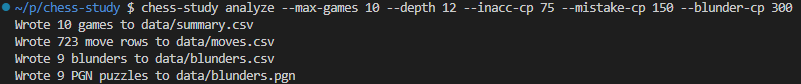
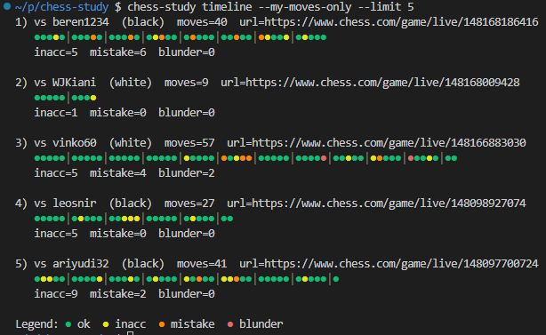
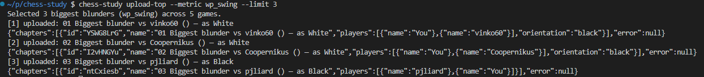

# chess-study — Chess.com → Stockfish → Lichess Study

This tool:
- downloads your recent games from Chess.com
- analyzes them locally with Stockfish
- uploads the biggest blunder per game into a Lichess Study as puzzle-like chapters

A “chapter” starts from the position before the mistake, shows your move, and includes the best move as a variation.

---

## Screenshots

1) **Terminal: analyze output**
- 

2) **Terminal: timeline view**
- 

3) **Lichess: created chapter**
- 


## What gets generated

By default, files are written into `./data/`:

- `data/summary.csv` — one row per game (includes Chess.com accuracy if provided)
- `data/moves.csv` — one row per move (good for graphing/debugging)
- `data/blunders.csv` — only moves that cross the blunder thresholds
- `data/blunders.pgn` — the blunder puzzles as PGN

---

## Commands

The installed command is:

```bash
chess-study --help
```

Main commands:

- `chess-study analyze` — download + analyze
- `chess-study timeline` — show a per-game “dot bar” timeline in the terminal
- `chess-study upload-top` — upload the biggest blunder per game to Lichess
- `chess-study sync` — analyze then upload (and optionally show the timeline)

---

## Install Stockfish (engine)

Stockfish is a native program (not a Python package). Install it in the same environment where you run `chess-study`.

### WSL2 (Ubuntu 20.04 and similar) recommended

On older WSL2 distros, downloaded Stockfish binaries can fail with "GLIBC not found". The most reliable approach is to build from source.

1) Install build tools:

```bash
sudo apt-get update
sudo apt-get install -y build-essential git
```

2) Build Stockfish (AVX2 is correct for most modern CPUs):

```bash
git clone https://github.com/official-stockfish/Stockfish.git
cd Stockfish/src

make -j profile-build ARCH=x86-64-avx2
```

3) Install it on your PATH:

```bash
mkdir -p ~/.local/bin

cp -f ./stockfish ~/.local/bin/stockfish
chmod +x ~/.local/bin/stockfish

echo 'export PATH="$HOME/.local/bin:$PATH"' >> ~/.bashrc
source ~/.bashrc
```

4) Verify:

```bash
stockfish
# you should see: Stockfish 17.1 (or later)
# type: quit
```

### macOS

```bash
brew install stockfish
```

---

## Install the chess-study CLI

From the repo directory:

```bash
uv tool install .
```

If you’re iterating locally and want to be 100% sure changes are included, build + install from the wheel:

```bash
uv build --wheel
uv tool install dist/*.whl --force
```

---

## Configuration (.env)

Create a `.env` file (do not commit it):

```bash
CHESSCOM_USER=your_chesscom_username
LICHESS_STUDY_ID=YourStudyId
LICHESS_TOKEN=YourTokenWithStudyWrite
```

Notes:
- `LICHESS_TOKEN` must include `study:write`
- `LICHESS_STUDY_ID` is the 8-character part of your study URL: `https://lichess.org/study/<THIS_PART>`

The CLI auto-loads `.env` from:
- your current folder, or
- `~/.config/chess-study/.env`

Optional global config:

```bash
mkdir -p ~/.config/chess-study
cp .env ~/.config/chess-study/.env
```

---

## Quick start

Analyze your most recent games and write `data/*`:

```bash
chess-study analyze --max-games 10 --depth 12 --inacc-cp 75 --mistake-cp 150 --blunder-cp 300
```

Show the terminal timeline (newest games first):

```bash
chess-study timeline --my-moves-only --limit 10
```

Upload the biggest blunder per game to Lichess:

```bash
chess-study upload-top --metric cp_loss --limit 10
```

Run analyze + upload in one command:

```bash
chess-study sync --max-games 10 --depth 12 --inacc-cp 75 --mistake-cp 150 --blunder-cp 300 --metric cp_loss --limit 10
```

---

## Understanding the metrics

### cp_loss (centipawn loss vs best)
A centipawn is 1/100 of a pawn. Bigger is worse.

For each of your moves, we compare:
- the engine evaluation after the **best move**
- versus after **your move**
(from the same starting position, at the same depth)

That difference is `cp_loss`. This is what we use to label moves as inaccuracy/mistake/blunder (via the cp thresholds).

### wp_swing (win-probability swing before→after)
This measures how much the eval bar moved from before your move to after your move.

Big swings can happen on good tactical moves too, so `wp_swing` is great for finding interesting moments, but it is not the main blunder label.

---

## Troubleshooting

- If Stockfish is not found: pass `--stockfish /path/to/stockfish`.
- If you see GLIBC errors on WSL2: build Stockfish from source as shown above.
- If Lichess upload fails with HTTP 400: check token scope (`study:write`) and the study ID.

---

## Security

Never commit `.env` or tokens. Put `.env` in `.gitignore`.
